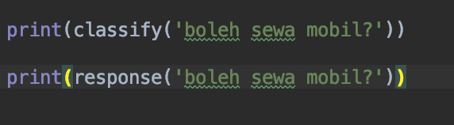
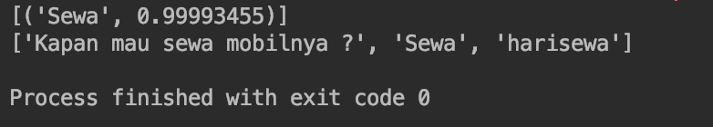

# siPintar

**Indonesian NLP chatbot** powered by a bag-of-words pipeline and a Multi-Layer Perceptron (MLP).  
Built for Bahasa Indonesia business chats (example domain: car rental FAQs), with a Django web UI.

---

## Features

- Intent classification from Indonesian text (greetings, hours, payments, rental flow, and more)
- NLP preprocessing: tokenization (NLTK) + stemming (PySastrawi)
- Trainable MLP model (TensorFlow + tflearn)
- Custom intents via JSON (`pengetahuan.json`)
- Simple chat UI served by Django

---

## How it works

```
User message
    → tokenize & stem (Bahasa Indonesia)
    → bag-of-words vector
    → MLP neural network
    → intent tag + confidence
    → pick a response from pengetahuan.json
```

Optional **context** fields in the dataset let the bot handle short multi-turn flows (for example: ask to rent → answer “today”).

---

## Tech stack

| Layer | Library |
|-------|---------|
| Web | Django |
| NLP | NLTK, Sastrawi (PySastrawi) |
| ML | TensorFlow 1.x, tflearn, NumPy |
| Data | JSON intents + pickled training metadata |

---

## Project structure

```
siPintar/
├── chatbot/
│   ├── model/
│   │   ├── pengetahuan.json   # intents, patterns, responses
│   │   ├── bot.py             # train the MLP and save the model
│   │   ├── respon.py          # classify input and return a reply
│   │   ├── model.tflearn*     # trained model files
│   │   └── training_data      # words, classes, train_x / train_y
│   ├── views.py               # Django chat endpoints
│   └── urls.py
├── matabot/                   # separate OpenCV experiment (not the chatbot)
├── templates/                 # chat UI templates
├── siPintar/                  # Django project settings
├── manage.py
└── requirements.txt
```

---

## Screenshots





---

## Requirements

- Python 3.x compatible with the pinned packages in `requirements.txt`
- pip

> **Note:** Dependencies target TensorFlow **1.9** / Django **2.0**. Prefer a dedicated virtual environment. Newer Python versions may need package adjustments.

---

## Setup

```bash
git clone <your-repo-url>
cd siPintar

python -m venv venv
# Windows
venv\Scripts\activate
# macOS / Linux
# source venv/bin/activate

pip install -r requirements.txt

# NLTK tokenizer data (required once)
python -c "import nltk; nltk.download('punkt')"

python manage.py migrate
python manage.py runserver
```

Open [http://127.0.0.1:8000/](http://127.0.0.1:8000/) and start chatting.

---

## Train with your own data

### 1. Edit the knowledge base

File: `chatbot/model/pengetahuan.json`

Each intent looks like:

```json
{
  "tag": "salam",
  "patterns": ["Hi", "halo", "pagi"],
  "responses": ["halo, ada apa?", "ada yang bisa dibantu?"],
  "context_set": ""
}
```

| Field | Purpose |
|-------|---------|
| `tag` | Intent label |
| `patterns` | Example user phrases to learn |
| `responses` | Possible bot replies (one is chosen at random) |
| `context_set` | Optional: set conversation context after this intent |
| `context_filter` | Optional: only match when that context is active |

### 2. Train the model

From `chatbot/model/`:

```bash
cd chatbot/model
python bot.py
```

This rebuilds `model.tflearn*` and `training_data`.

### 3. Test classification / response (optional)

```bash
python respon.py
```

If `respon.py` fails on import or path errors, update the hardcoded `sys.path.append(...)` near the top of `chatbot/model/respon.py` so it points to this project root on your machine, and keep:

```python
os.environ.setdefault("DJANGO_SETTINGS_MODULE", "siPintar.settings")
```

Then restart the Django server to use the new model in the UI.

---

## Example intents (default dataset)

The sample `pengetahuan.json` covers a small car-rental assistant, including:

- Greetings / goodbye / thanks  
- Opening hours  
- Available cars  
- Payment methods  
- Rental request + “today” follow-up (context)

Replace or extend these tags to fit your own domain.

---

## License

MIT — see [LICENSE](LICENSE).

Originally created by [Rino Alfian](https://github.com/kunci115).
